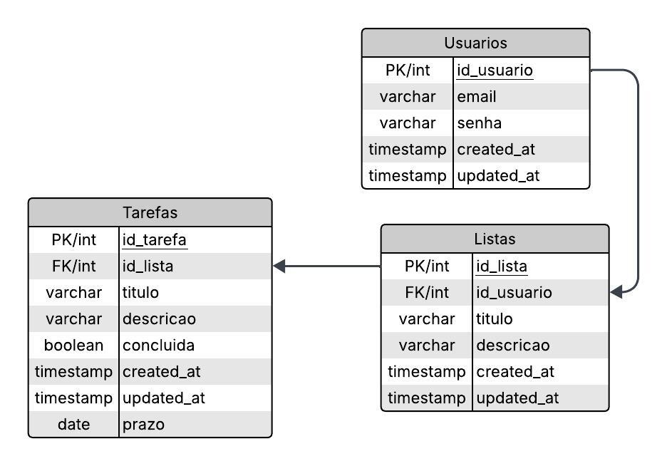

# Modelagem do Banco de Dados

Abaixo, segue o modelo relacional que foi desenvolvido para o desafio, com um relacionamento **1:N** entre *Listas* e *Tarefas* — ou seja, **uma lista pode possuir várias tarefas**. 
E uma lista está ligada a um *usuário* , isso quer dizer que um **usuário pode possuir várias listas**

